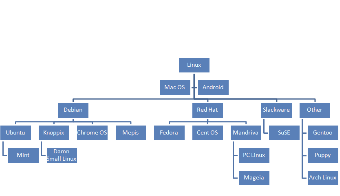

# Linux 
## 개념
### 커널의 일종인 리눅스 커널, 리눅스 커널을 사용하는 Unix기반의 운영체제




- 유닉스를 기반으로 개발된 오퍼레이팅 시스템
- 과거 유닉스 사용화로 사용료 요구하는 것에 반발로 시작된 ```GNU``` 프로젝트
- 누구나 공개된 소스를 수정하고 배포할 수 있게 함
- 오픈 소스 운동

=> GNU 프로젝트에서 운영체제에 필요한 라이브러리, 컴파일러, 텍스트 편집기 등을 만들며 결국 리눅스 커널을 발표

## 특징
- 유닉스(Minix) 기반
- 다중 사용자와 멀티 태스킹을 지원 : 보안성이 높은 파일을 관리하기 용이하고 서버에서 많이 쓰임
- 자유 소프트웨어

